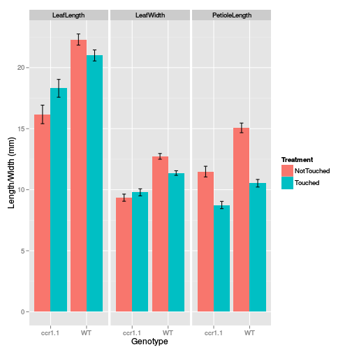

Nazia's touch data
==================

Read in the data, and split out tables by measurement

```r
library(ggplot2)
library(plyr)

a <- read.csv("TouchData.csv", header = T, quote = "")
summary(a)
```

```
##    Genotype        Treatment        Tray           Rep      
##  ccr1.1:197   NotTouched:215   Min.   :1.00   Min.   : 1.0  
##  WT    :252   Touched   :234   1st Qu.:1.00   1st Qu.:10.0  
##                                Median :2.00   Median :19.0  
##                                Mean   :2.15   Mean   :19.6  
##                                3rd Qu.:3.00   3rd Qu.:29.0  
##                                Max.   :9.00   Max.   :42.0  
##         Measurement      Value      
##  LeafLength   :150   Min.   : 4.05  
##  LeafWidth    :149   1st Qu.:10.35  
##  PetioleLength:150   Median :12.58  
##                      Mean   :14.10  
##                      3rd Qu.:18.33  
##                      Max.   :27.17
```

```r
str(a)
```

```
## 'data.frame':	449 obs. of  6 variables:
##  $ Genotype   : Factor w/ 2 levels "ccr1.1","WT": 2 2 2 2 2 2 2 2 2 2 ...
##  $ Treatment  : Factor w/ 2 levels "NotTouched","Touched": 1 1 1 1 1 1 1 1 1 1 ...
##  $ Tray       : int  1 1 1 1 1 1 1 1 1 1 ...
##  $ Rep        : int  1 2 3 4 5 6 7 8 9 10 ...
##  $ Measurement: Factor w/ 3 levels "LeafLength","LeafWidth",..: 1 1 1 1 1 1 1 1 1 1 ...
##  $ Value      : num  20.4 21.2 23.1 14.1 14.1 ...
```

```r


ll <- a[a$Measurement == "LeafLength", -5]
lw <- a[a$Measurement == "LeafWidth", -5]
pl <- a[a$Measurement == "PetioleLength", -5]
summary(ll)
```

```
##    Genotype       Treatment       Tray           Rep           Value      
##  ccr1.1:66   NotTouched:72   Min.   :1.00   Min.   : 1.0   Min.   : 6.69  
##  WT    :84   Touched   :78   1st Qu.:1.00   1st Qu.:10.0   1st Qu.:17.81  
##                              Median :2.00   Median :19.0   Median :20.32  
##                              Mean   :2.15   Mean   :19.6   Mean   :19.75  
##                              3rd Qu.:3.00   3rd Qu.:28.8   3rd Qu.:22.70  
##                              Max.   :9.00   Max.   :42.0   Max.   :27.17
```

```r
summary(lw)
```

```
##    Genotype       Treatment       Tray           Rep           Value      
##  ccr1.1:65   NotTouched:71   Min.   :1.00   Min.   : 1.0   Min.   : 5.02  
##  WT    :84   Touched   :78   1st Qu.:1.00   1st Qu.:10.0   1st Qu.: 9.95  
##                              Median :2.00   Median :19.0   Median :10.97  
##                              Mean   :2.15   Mean   :19.5   Mean   :10.97  
##                              3rd Qu.:3.00   3rd Qu.:28.0   3rd Qu.:12.19  
##                              Max.   :9.00   Max.   :42.0   Max.   :15.84
```

```r
summary(pl)
```

```
##    Genotype       Treatment       Tray           Rep           Value      
##  ccr1.1:66   NotTouched:72   Min.   :1.00   Min.   : 1.0   Min.   : 4.05  
##  WT    :84   Touched   :78   1st Qu.:1.00   1st Qu.:10.0   1st Qu.: 9.27  
##                              Median :2.00   Median :19.0   Median :11.19  
##                              Mean   :2.15   Mean   :19.6   Mean   :11.56  
##                              3rd Qu.:3.00   3rd Qu.:28.8   3rd Qu.:13.72  
##                              Max.   :9.00   Max.   :42.0   Max.   :20.91
```


Then, do boxplots, AOV and Tukey's HSD on the full dataset, and each of the split datasets.

```r
boxplot(Value ~ Genotype + Treatment, data = pl)
```

 

```r
a_aov <- aov(Value ~ Genotype * Treatment + Measurement, data = a)
summary(a_aov)
```

```
##                     Df Sum Sq Mean Sq F value  Pr(>F)    
## Genotype             1   1119    1119   148.3 < 2e-16 ***
## Treatment            1    217     217    28.7 1.4e-07 ***
## Measurement          2   7220    3610   478.8 < 2e-16 ***
## Genotype:Treatment   1    152     152    20.1 9.4e-06 ***
## Residuals          443   3340       8                    
## ---
## Signif. codes:  0 '***' 0.001 '**' 0.01 '*' 0.05 '.' 0.1 ' ' 1
```

```r
TukeyHSD(a_aov)
```

```
##   Tukey multiple comparisons of means
##     95% family-wise confidence level
## 
## Fit: aov(formula = Value ~ Genotype * Treatment + Measurement, data = a)
## 
## $Genotype
##            diff   lwr   upr p adj
## WT-ccr1.1 3.181 2.667 3.694     0
## 
## $Treatment
##                      diff    lwr     upr p adj
## Touched-NotTouched -1.388 -1.898 -0.8787     0
## 
## $Measurement
##                             diff     lwr    upr  p adj
## LeafWidth-LeafLength     -8.7838 -9.5307 -8.037 0.0000
## PetioleLength-LeafLength -8.1901 -8.9357 -7.445 0.0000
## PetioleLength-LeafWidth   0.5937 -0.1532  1.341 0.1489
## 
## $`Genotype:Treatment`
##                                      diff     lwr    upr  p adj
## WT:NotTouched-ccr1.1:NotTouched   4.35110  3.3706  5.332 0.0000
## ccr1.1:Touched-ccr1.1:NotTouched -0.06869 -1.0824  0.945 0.9981
## WT:Touched-ccr1.1:NotTouched      1.93480  0.9543  2.915 0.0000
## ccr1.1:Touched-WT:NotTouched     -4.41978 -5.3483 -3.491 0.0000
## WT:Touched-WT:NotTouched         -2.41630 -3.3084 -1.524 0.0000
## WT:Touched-ccr1.1:Touched         2.00349  1.0749  2.932 0.0000
```


Leaf Length shows significant Geno effect & Geno:Treatement interaction effect. There are
significant differerences between Genotype & Treatement points as shown in the Tukey HSD output
under $Genotype:Treatment.

```r
ll_aov <- aov(Value ~ Genotype * Treatment, data = ll)
summary(ll_aov)
```

```
##                     Df Sum Sq Mean Sq F value  Pr(>F)    
## Genotype             1    688     688   53.37 1.7e-11 ***
## Treatment            1      2       2    0.12  0.7284    
## Genotype:Treatment   1    109     109    8.43  0.0043 ** 
## Residuals          146   1883      13                    
## ---
## Signif. codes:  0 '***' 0.001 '**' 0.01 '*' 0.05 '.' 0.1 ' ' 1
```

```r
TukeyHSD(ll_aov)
```

```
##   Tukey multiple comparisons of means
##     95% family-wise confidence level
## 
## Fit: aov(formula = Value ~ Genotype * Treatment, data = ll)
## 
## $Genotype
##            diff   lwr   upr p adj
## WT-ccr1.1 4.316 3.148 5.483     0
## 
## $Treatment
##                     diff    lwr   upr  p adj
## Touched-NotTouched 0.204 -0.956 1.364 0.7286
## 
## $`Genotype:Treatment`
##                                    diff     lwr     upr  p adj
## WT:NotTouched-ccr1.1:NotTouched   6.132  3.9008  8.3632 0.0000
## ccr1.1:Touched-ccr1.1:NotTouched  2.137 -0.1704  4.4444 0.0802
## WT:Touched-ccr1.1:NotTouched      4.831  2.5993  7.0618 0.0000
## ccr1.1:Touched-WT:NotTouched     -3.995 -6.1150 -1.8750 0.0000
## WT:Touched-WT:NotTouched         -1.301 -3.3383  0.7354 0.3484
## WT:Touched-ccr1.1:Touched         2.694  0.5736  4.8136 0.0066
```


Leaf width show very significant Geno effect, sig. treatment effect, & a sig. interaction term.
Tukeys HSD shows the only non-signficant comparison is *ccr1.1* Touch vs Non-touched.

```r
lw_aov <- aov(Value ~ Genotype * Treatment, data = lw)
summary(lw_aov)
```

```
##                     Df Sum Sq Mean Sq F value  Pr(>F)    
## Genotype             1    222   221.7   97.89 < 2e-16 ***
## Treatment            1     13    12.7    5.62 0.01910 *  
## Genotype:Treatment   1     30    29.5   13.03 0.00042 ***
## Residuals          145    328     2.3                    
## ---
## Signif. codes:  0 '***' 0.001 '**' 0.01 '*' 0.05 '.' 0.1 ' ' 1
```

```r
TukeyHSD(lw_aov)
```

```
##   Tukey multiple comparisons of means
##     95% family-wise confidence level
## 
## Fit: aov(formula = Value ~ Genotype * Treatment, data = lw)
## 
## $Genotype
##           diff   lwr   upr p adj
## WT-ccr1.1 2.46 1.968 2.951     0
## 
## $Treatment
##                       diff    lwr      upr  p adj
## Touched-NotTouched -0.5842 -1.072 -0.09632 0.0193
## 
## $`Genotype:Treatment`
##                                     diff     lwr     upr  p adj
## WT:NotTouched-ccr1.1:NotTouched   3.3834  2.4390  4.3277 0.0000
## ccr1.1:Touched-ccr1.1:NotTouched  0.4344 -0.5416  1.4103 0.6550
## WT:Touched-ccr1.1:NotTouched      2.0171  1.0728  2.9615 0.0000
## ccr1.1:Touched-WT:NotTouched     -2.9490 -3.8374 -2.0606 0.0000
## WT:Touched-WT:NotTouched         -1.3662 -2.2198 -0.5127 0.0003
## WT:Touched-ccr1.1:Touched         1.5828  0.6944  2.4712 0.0000
```


Again, for petiole length, pretty much everything is significant. Only WT touched vs *ccr1.1* not touched is non-significant.

```r
pl_aov <- aov(Value ~ Genotype * Treatment, data = pl)
summary(pl_aov)
```

```
##                     Df Sum Sq Mean Sq F value  Pr(>F)    
## Genotype             1    291     291    59.7 1.6e-12 ***
## Treatment            1    525     525   107.4 < 2e-16 ***
## Genotype:Treatment   1     30      30     6.1   0.015 *  
## Residuals          146    713       5                    
## ---
## Signif. codes:  0 '***' 0.001 '**' 0.01 '*' 0.05 '.' 0.1 ' ' 1
```

```r
TukeyHSD(pl_aov)
```

```
##   Tukey multiple comparisons of means
##     95% family-wise confidence level
## 
## Fit: aov(formula = Value ~ Genotype * Treatment, data = pl)
## 
## $Genotype
##            diff   lwr   upr p adj
## WT-ccr1.1 2.808 2.089 3.526     0
## 
## $Treatment
##                     diff    lwr    upr p adj
## Touched-NotTouched -3.74 -4.453 -3.026     0
## 
## $`Genotype:Treatment`
##                                     diff     lwr     upr  p adj
## WT:NotTouched-ccr1.1:NotTouched   3.5830  2.2101  4.9559 0.0000
## ccr1.1:Touched-ccr1.1:NotTouched -2.7362 -4.1559 -1.3164 0.0000
## WT:Touched-ccr1.1:NotTouched     -0.9522 -2.3251  0.4206 0.2763
## ccr1.1:Touched-WT:NotTouched     -6.3192 -7.6236 -5.0148 0.0000
## WT:Touched-WT:NotTouched         -4.5353 -5.7885 -3.2820 0.0000
## WT:Touched-ccr1.1:Touched         1.7839  0.4795  3.0884 0.0028
```


Summarise and plot data in a pretty ggplot graph

```r
plotData <- ddply(a, c("Genotype", "Treatment", "Measurement"), summarise, mean = mean(Value, 
    na.rm = TRUE), sd = sd(Value, na.rm = TRUE), n = sum(!is.na(Value)), se = sd/sqrt(n))

ggplot(plotData, aes(x = Genotype, y = mean, fill = Treatment)) + geom_bar(stat = "identity", 
    position = "dodge") + geom_errorbar(aes(ymin = mean - se, ymax = mean + 
    se), width = 0.2, position = position_dodge(width = 0.9)) + facet_wrap(~Measurement) + 
    ylab("Length/Width (mm)")
```

 

